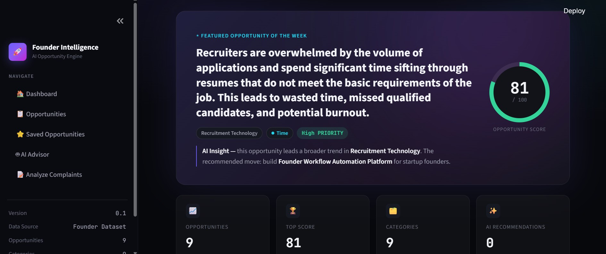
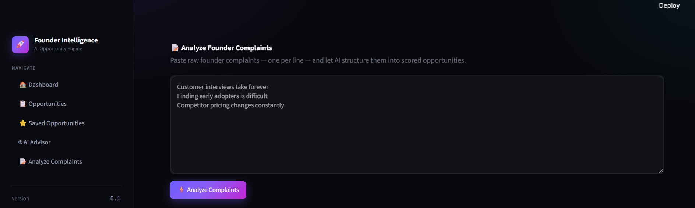
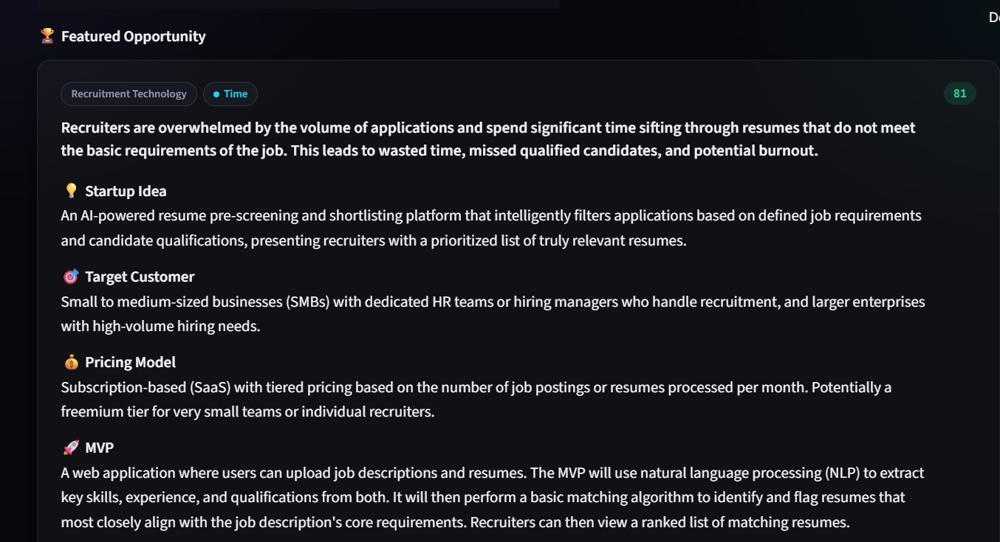
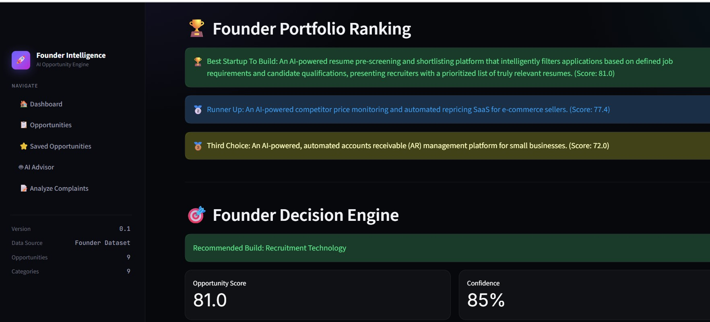
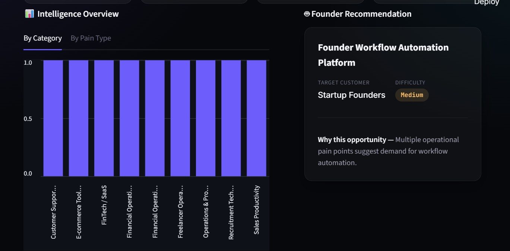
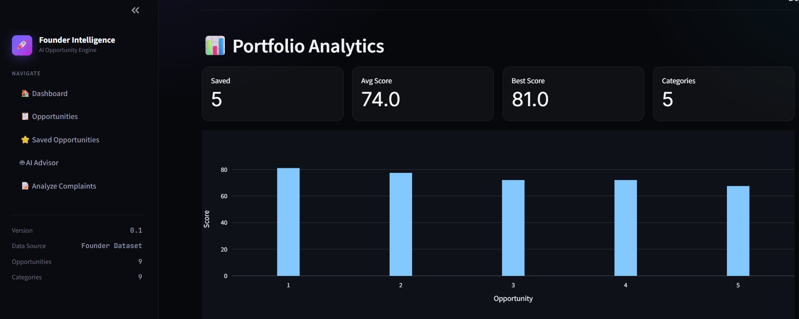
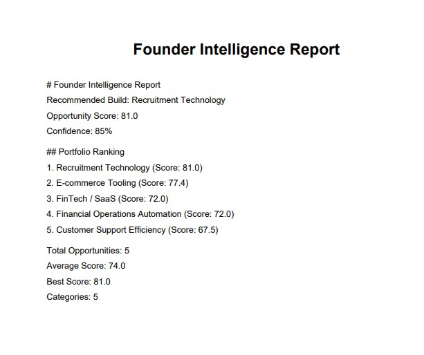

# Founder Intelligence Platform

AI-powered platform that transforms customer pain points into validated startup opportunities.

The platform analyzes founder complaints, generates startup ideas, scores opportunities, ranks them, and recommends the best business opportunities to build.

---

## Problem

Founders often struggle to identify which problems are worth solving.

Customer complaints contain valuable startup opportunities, but manually analyzing hundreds of complaints is slow and subjective.

Founder Intelligence Platform automates opportunity discovery and helps founders focus on the most promising ideas.

---

## Features

### AI Complaint Analysis

* Analyze founder and customer complaints using Gemini AI
* Extract structured business opportunities
* Identify customer pain points and market gaps

### Opportunity Scoring Engine

* Weighted scoring model based on:

  * Severity
  * Frequency
  * Willingness to Pay
  * Evidence Strength
  * Competition Level

### Opportunity Explorer

* Browse all discovered opportunities
* Filter by category
* Filter by pain type
* Filter by opportunity score

### AI Founder Advisor

* Generate startup recommendations
* Explain opportunity strengths and risks
* Suggest next actions

### Founder Portfolio Management

* Save promising opportunities
* Build a startup opportunity portfolio
* Compare opportunities side-by-side

### Founder Decision Engine

* Automatically selects the strongest opportunity
* Explains reasoning behind the recommendation
* Generates confidence scores

### Portfolio Analytics

* Opportunity score visualization
* Portfolio statistics
* Category analysis
* Founder insights

### Founder Report Export

* Generate downloadable PDF reports
* Portfolio ranking summaries
* Founder recommendations

---

## Screenshots

### Dashboard

### Analyze Complaints

### Opportunity Explorer

### Portfolio Ranking

### Founder Decision Engine

### Portfolio Analytics & Insights

### Founder Report

## Workflow

Customer Complaint
↓
AI Analysis
↓
Startup Opportunity Generation
↓
Opportunity Scoring
↓
Portfolio Ranking
↓
Founder Decision Engine
↓
Analytics & Reporting

---

## Tech Stack

### Frontend

* Streamlit

### Backend

* Python

### AI

* Google Gemini API

### Data Processing

* Pandas

### Visualization

* Plotly

### Reporting

* ReportLab

### Storage

* JSON

---

## Project Structure

app/
├── dashboard.py
├── scripts/
├── data/
│   ├── live/
│   └── raw/
├── assets/
└── requirements.txt

---

## Current Status

### Version 2 Complete

Implemented:

* Dashboard
* Opportunity Explorer
* AI Advisor
* Saved Opportunities
* Portfolio Ranking
* Founder Decision Engine
* Portfolio Analytics
* Founder Insights
* PDF Report Export

### Planned (V3)

* Reddit Complaint Discovery
* Trend Detection
* Live Founder Intelligence Feed
* Opportunity Alerts
* Automated Opportunity Monitoring

---

## Screenshots

(Add screenshots here)

* Dashboard
* Opportunity Explorer
* AI Advisor
* Founder Decision Engine
* Portfolio Analytics
* PDF Report

---

## Author

Eshika Nagpal

BSc in Computer Science and Data Science

Indian Institute of Technology Madras
